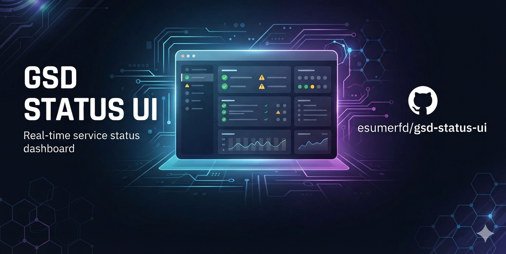
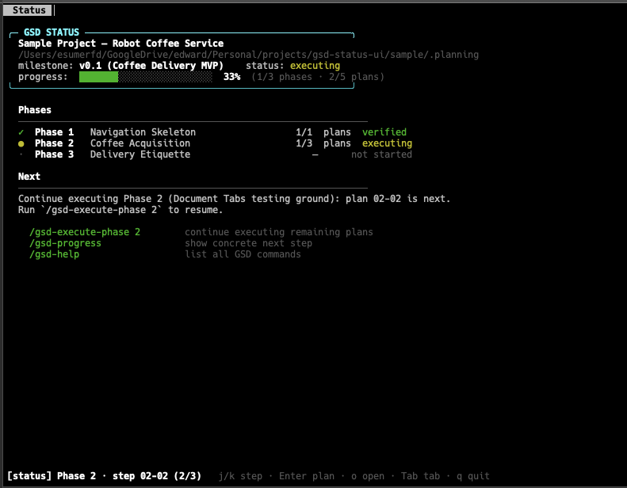
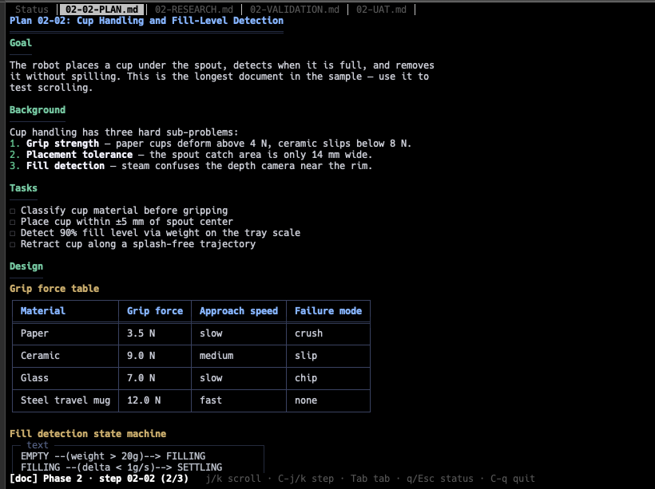

# gsd-status-ui



A terminal status view for [GSD](https://github.com/open-gsd/gsd-core) planning
workspaces — point it at a project directory and it reports which phase you're
on, how many plans are done, and what to run next.

## Features

* Instant review of current status.
* Review all generated documents with a keystroke.
* Update status when GSD/agent gets it wrong.
* Focus one GSD workstream at a time, and switch between them with `S`.

## What it reads

GSD ([open-gsd/gsd-core](https://github.com/open-gsd/gsd-core)) is a slash-command
workflow system that drives phase-based project planning through Claude Code. As
a project moves through discussion, planning, execution, and verification, GSD
writes and updates a `.planning/` directory: `PROJECT.md`, `ROADMAP.md`,
`STATE.md`, and per-phase `PLAN.md` / `SUMMARY.md` / `VERIFICATION.md` documents.

`gsd-status-ui` doesn't drive that workflow — it's a viewer of the
`.planning/` tree GSD produces. It parses those files and renders a summary of
project progress and a suggested next command, without needing gsd-core itself
installed. It does have the ability to update status of a task.

## Usage

```bash
gsd-status [path]
```

If `path` is omitted, it walks up from the current directory looking for a
`.planning/` directory. Output looks like:



Honors `NO_COLOR`; colored output is skipped automatically when stdout isn't a
terminal.

The interactive TUI lets you drill into a phase's plan, research, validation,
and UAT documents:



An interactive TUI mode (step/tab navigation over a phase's Plan, Research,
Validation, Context, and Discussion documents, backed by the `leaf-adapter`
crate) is under active development — see
[Project layout](development.md#project-layout).

### Workstreams

In a workspace that uses GSD workstreams (`.planning/workstreams/<name>/`),
`gsd-status` focuses one workstream at a time — by default the one GSD itself
considers current, resolved in GSD's own order: `--ws`, then `GSD_WORKSTREAM`,
then `.planning/active-workstream`, then the first workstream by name.

```bash
gsd-status --ws alpha        # focus a specific workstream
GSD_WORKSTREAM=alpha gsd-status
```

Press `S` in the TUI to switch between them. Switching is view-only — it never
writes GSD's `.planning/active-workstream` pointer, so other GSD sessions in
the same repo are unaffected. Shared content (`todos/`, `notes/`, `research/`)
stays visible while a workstream is focused. In a workspace with no
`workstreams/` directory nothing changes and `S` reports there are none.

A partially-migrated workspace — one whose `.planning/` root still holds its
own `ROADMAP.md`, `STATE.md`, or `phases/` beside `workstreams/` — also gets a
`(base)` entry at the top of the picker. Those root files are workstream-scoped
by GSD's rules, so nothing else can reach them; `(base)` is the way in. It is
omitted when the root has nothing scoped of its own, where it would only open
an empty panel.

## Install

### Homebrew

```bash
brew tap esumerfd/gsd-status-ui https://github.com/esumerfd/gsd-status-ui
brew install esumerfd/gsd-status-ui/gsd-status
```

Binaries are prebuilt for macOS (Apple Silicon and Intel) and Linux (x86_64)
by the [release workflow](.github/workflows/release.yml), which publishes them
to GitHub Releases and updates [`Formula/gsd-status.rb`](Formula/gsd-status.rb).

## Development

Building from source, cutting a release, the sample workspaces, and the code
layout all live in [`development.md`](development.md).
